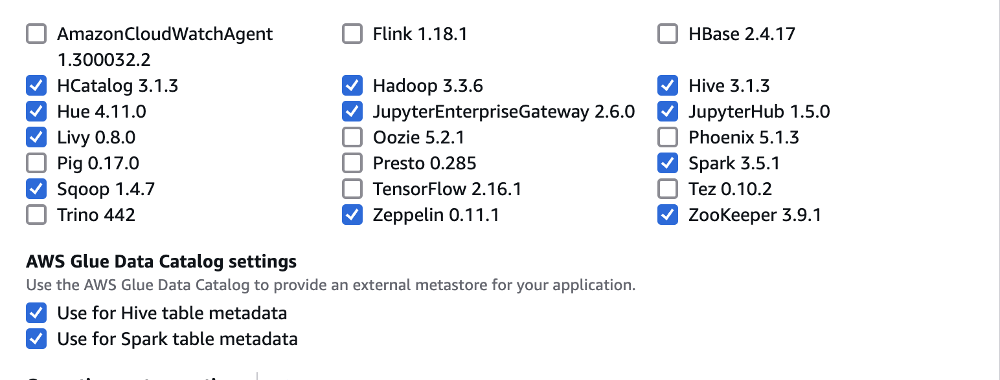
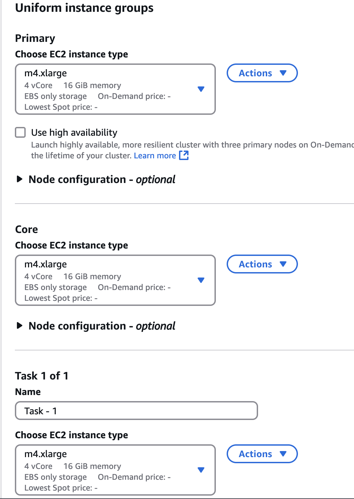

# Lab 0: Configuración de Clúster EMR en AWS

## Creación del Clúster

1. Busca el servicio de **EMR** en AWS.
2. Haz clic en la opción **Create cluster**.
3. Asigna un nombre al clúster, selecciona la versión y el bundle deseado. En nuestro caso, haremos una configuración personalizada con los siguientes paquetes:

   

4. En la sección **Uniform instance groups**, bajo las subopciones **Primary, Core y Task**, elige el tipo de instancia. En este caso, se ha seleccionado `m4.xlarge`.

   

5. En la sección **EC2 security groups (firewall)**, configura los roles de IAM de la siguiente manera:
   - **Service role**: `EMR_DefaultRole`
   - **Instance profile**: `EMR_EC2_DefaultRole`
   - **Custom automatic scaling role**: `EMR_AutoScaling_DefaultRole`

6. En **Software settings**, configura el almacenamiento de los notebooks de Jupyter en un bucket de S3. Para esto, asegúrate de tener el bucket creado previamente. La configuración es la siguiente:

   ```json
   [
     {
       "Classification": "jupyter-s3-conf",
       "Properties": {
         "s3.persistence.bucket": "ssalazarnotebooks",
         "s3.persistence.enabled": "true"
       }
     }
   ]
   ```

7. En **Security configuration and EC2 key pair**, selecciona la clave que usarás para acceder al clúster.
8. Haz clic en **Create cluster**.
9. El clúster tardará aproximadamente 20 minutos en crearse por completo. Sabremos que la creación es exitosa cuando el estado cambie a **Waiting** en color verde.
10. Una vez creado el clúster, ve al servicio **EC2**. Verás tres instancias nuevas. Debes ir a la instancia **master** y agregar tres puertos al grupo de seguridad:
    - **22** para SSH
    - **9870** para HDFS
    - **14000** para Hue

## Acceder al Clúster

1. Cuando el clúster esté creado, para acceder al servicio de **Hue**, simplemente ve a la pestaña **Applications** dentro del clúster y haz clic en el enlace de **Hue**. Si esto no funciona, deberás crear un túnel SSH para acceder al servicio. Para esto, abre tu terminal y ejecuta el siguiente comando (reemplaza con tu propia clave, IP, puerto, etc.):

   ```sh
   ssh -i "tu_clave.pem" -L 8888:localhost:8888 hadoop@ec2-34-238-194-48.compute-1.amazonaws.com
   ```

   ### Nota
   Si quieres acceder a **Jupyter**, deberás crear otro túnel utilizando el puerto correspondiente a Jupyter (en este caso, el **9443**).

## Información Final

Los clústeres EMR no son persistentes, lo que significa que cada vez que termines de trabajar con uno, este se finalizará automáticamente. Por lo tanto, deberás clonar el clúster cada vez que necesites trabajar en él. Para preservar la información, usamos un bucket de S3 para almacenar los notebooks de Jupyter y otros datos relevantes.