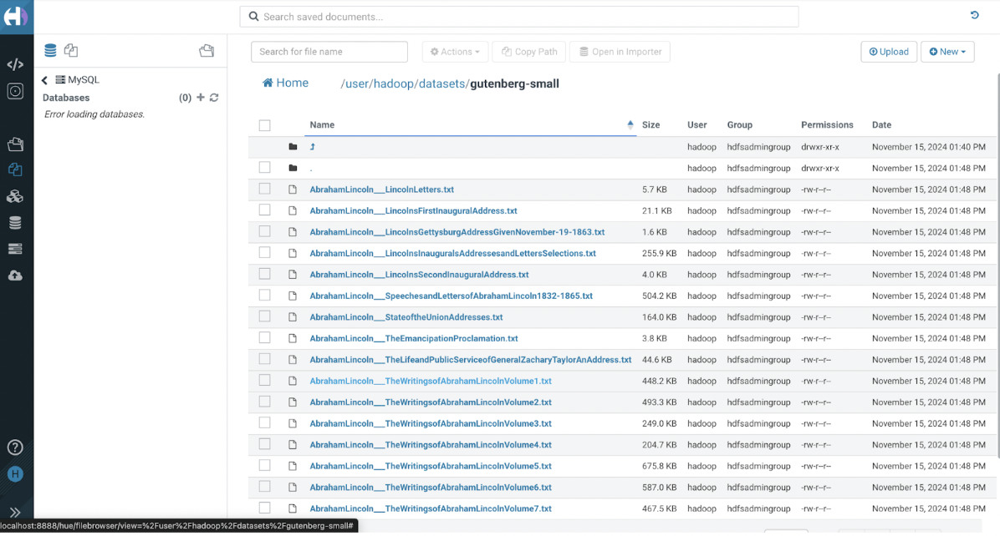

# Laboratorio 1: Uso de HDFS

1. Primero debemos acceder al cluster de EMR, para ello vamos a una terminal y hacemos el siguiente comando:
```bash
ssh -i "llave.pem" hadoop@"direccion.ip.de.cluster"

```

2. Instalamos Git en el cluster
```bash
sudo yum install git 
```
3. Cuando estemos dentro de la maquina debemos de clonar el repositorio


4. Vamos a crear las carpetas donde guardaremos los datos en Hadoop


5. Usamos el siguiente comando para mover los datos desde el sistema local a Hadoop

```bash
hdfs dfs -put st0263-242/bigdata/datasets/gutenberg-small/*.txt /user/hadoop/datasets/gutenberg-small/ 

```

6. Si quieres guardar los archivos en el bucket puedes realizar el siguiente comando:
```bash
hadoop fs -put st0263-242/bigdata/datasets/ s3://ssalazarnotebooks/

```

7. Al terminar este proceso, cuando accedamos a Hue vamos a encontrar el dataset con los datos.


