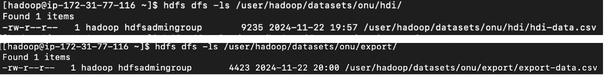
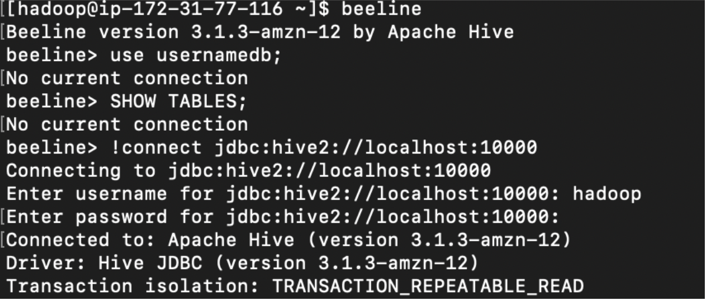
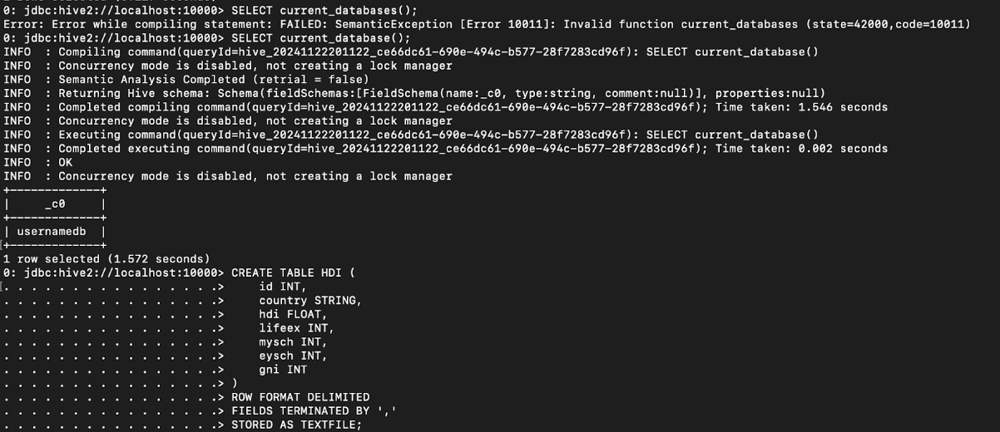
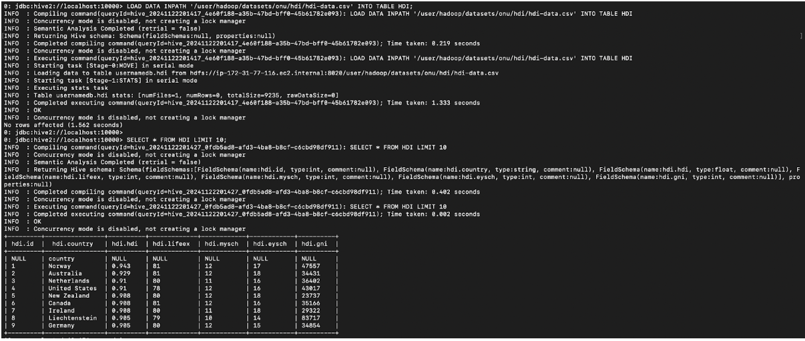

# Laboratorio2: Hive

1. Empezamos teniendo los datos necesarios en Hadoop


2. Despues usamos el comando ```beeline``` para acceder a Hive, despues debemos conectarnos. De nombre de usuario y contraseña podemos poner lo que queramos:


3. Ahora conectamos en Hive, vamos a usar la base de datos que queramos (en mi caso usaré una llamada usernamedb) y vamos a crear la tabla para los datos.


4. Ahora que tenemos la tabla creada, podemos montar los datos y hacer cualquier tipo de query con ellos
