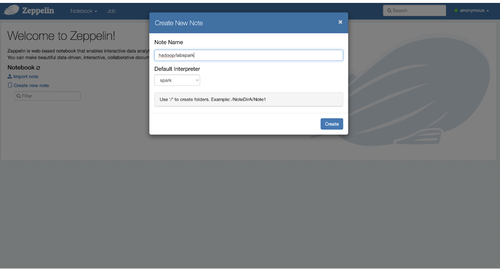
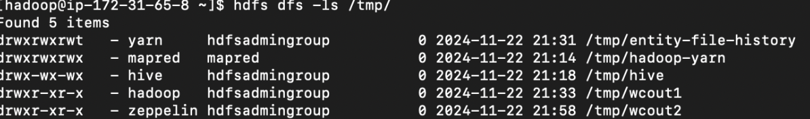

# Laboratorio 3: Spark
## Metodo 1, pyspark en terminal
1. dentro del cluster hacemos el comando ```pyspark``` para acceder a spark.

2. Tomamos los datos que vamos a procesar y los pasamos con el siguiente codigo:
```pyspark
 files_rdd = sc.textFile("hdfs:///datasets/gutenberg-small/*.txt")
 wc_unsort = files_rdd.flatMap(lambda line: line.split()).map(lambda word: (word, 1)).reduceByKey(lambda a, b: a + b)
 wc = wc_unsort.sortBy(lambda a: -a[1])
 for tupla in wc.take(10):
         print(tupla)
    wc.saveAsTextFile("hdfs:///tmp/wcout1")
```
Este codigo se encarga de procesar los datos y guardarlos en Hadoop dentro de la carpeta tmp/wcout1. Puedes escoger de donde obtienes los datos, en mi caso los tenia en Hadoop.

## Metodo 2, Zeppelin
Otra forma en la que podemos procesar los datos es usando Zeppelin. Esta aplicación es similar a Jupyter ya que acá podemos escoger el interpretador y correr el codigo que queramos.

1. Primero empezamos ejecutando Zepellin, creamos una nueva note y escogemos el interpretador que queramos, en este caso spark.


2. Creamos un bloque de codigo y ponemos el mismo que usamos en pyspark.


3. Ahora si revisamos la carpeta donde guardamos toda la información, encontraremos que tenemos tanto la creada por pyspark como la que creamos con Zepellin.
